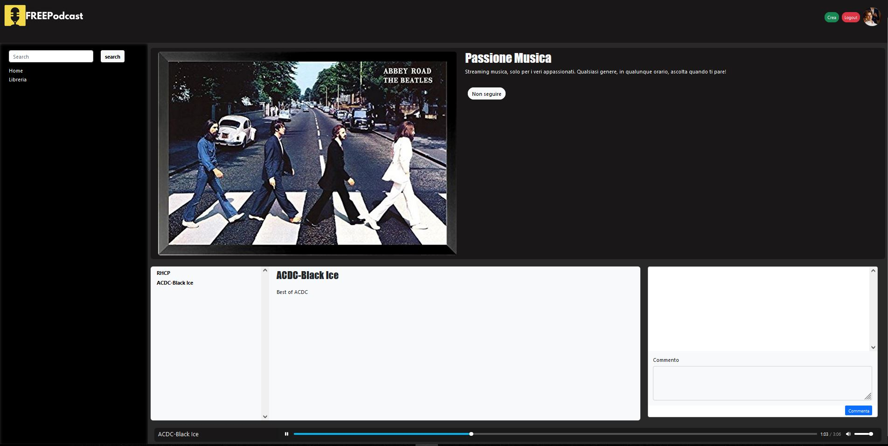

# podcast-player
Podcast player website developed for the Introduzione alle Applicazioni Web course, BSc at Politecnico di Torino.

Users can register and login.
Some users are "creators" meaning they can create podcasts inserting audio tracks.
Comments can be posted on the single episodes.
Moreover a simple category filter and search bar are implementing using JavaScript.

